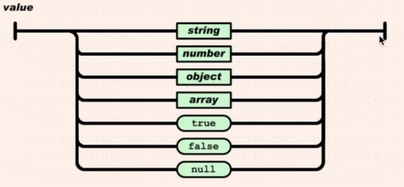

# JSON vs JavaScript
1. JSON 与JavaScript有什么不同

    首先JSON与JavaScript是两种不同的语言，是道格拉斯抄袭了Brendan Eich
    的JavaScript发明了JSON,值得一提的是道格拉斯写过一本书叫
    《JavaScript语言精粹》，他写这本书是用来怼Brendan Eich的，所以Brendan Eich
    非常讨厌JSON语言的发明者道格拉斯。因为JSON语言就是抄袭JS而成的，所以相似
    之处还是有的，除了undefined,function以及变量之外 全部都抄过来了，而且对于
    字符串只能使用双引号
     
    JSON中的类型 
     
    